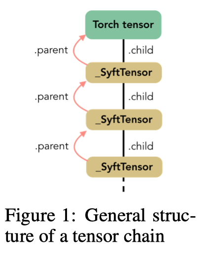
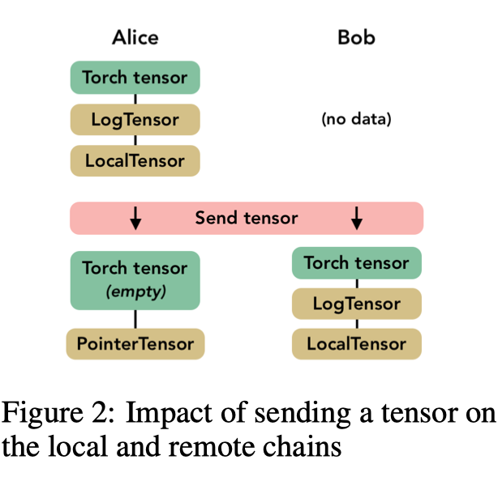

# A generic framework for privacy preserving deep learning
一个隐私保护深度学习的通用框架

# Abstract
我们详细介绍了一个新的隐私框架，以保护深度学习并讨论其优点。该框架重视所有权和数据的安全处理，并基于the chain of commands and tensors来引入了有价值的表示。这种抽象**允许人们实现复杂的隐私保护结构，如联合学习，安全多方计算和差异隐私，同时仍然向最终用户公开熟悉的深度学习API**。我们报告基于Boston Housing和Pima Indian Diabetes数据集的早期结果。虽然除差异隐私之外的隐私功能不会影响预测准确性，框架的当前实现方面导致显着的性能开销，将在开发的后期阶段解决。里程碑，第一个通用框架基于隐私保护的深度学习框架。

# 1 Introduction
安全多方计算（SMPC）作为在不信任环境中执行操作而不泄露数据的方式正变得越来越流行。在机器学习模型的情况下，SMPC将保护模型权重，同时允许多个工作节点使用自己的数据集参与训练阶段，比如联合学习。但是，已经证明，安全训练的模型仍然容易受到逆向工程攻击，这些攻击可以直接从模型中提取有关数据集的敏感信息。标记为差分专用（DP）方法的另一组方法解决了这个问题，并且可以有效地保护数据。我们为每个PyTorch用户提供透明的隐私保护框架，保护深度学习，从直观的界面中使用FL，MPC和DP。我们展示了框架支持MPC和DP解决方案的各种实现的能力，并报告了在联合学习环境中分别为MPC和DP实例化SPDZ和时刻会计方法时获得的结果。

我们的主要贡献如下：

- 建立了一个标准化协议在worker之间的通信，协调联合学习
- 让我们开发一个基于Tensor的链式抽象模型，可以重写操作 例如发送和共享一个Tensor 在两个worker之间。
- 最后，我们提供了元素， 运用框架实现 最近提出的dp和mcp算法。
通过这样做，我们打算帮助推广在机器学习中的隐私保护技术通过研究人员和数据科学家每天使用的可得到通用工具。FL, MPC和DP作为可插拔的模块。

# 2 A standardized framework to abstract operations on Tensors
## 2.1 The chain structure
**执行转换或向其他worker发送Tensor**可以表示为一系列操作，**每个操作都由一个特殊的类来体现**。为此，我们创建了一个名为SyftTensor的抽象类。SyftTensors旨在表示数据的状态或转换，并且可以链接在一起。*链结构总是在其头部具有PyTorch张量，并且使用子属性向下访问SyftTensors所体现的变换或状态，并使用父属性向上访问。*

上图显示了Tensor chain的一般结构，其中SyftTensors被一些子类的实例替换，这些子类都具有特定的角色，比如接下来将描述的LocalTensor类。**所有操作首先应用于Torch张量，这使得可以使用native Torch interface，然后通过chain 转发到子属性。**

SyftTensor有两个重要的子类。首先，LocalTensor是在实例化Torch张量时自动创建的。(Its role is to perform on the Torch tensor the native operation corresponding to the overloaded operation.=>它的作用是在Torch张量上执行(相对应的被重载过的)native operation)。例如，如果命令是add，则LocalTensor将在头张量上执行native Torch命令native_add。该链有两个节点，它循环使得LocalTensor子节点引用包含数据的head node tensor，而不需要重新创建子张量对象，这会降低性能。??

trask:
So this particular aspect we're sortof getting rid of in the 1,0 refactor
Basically in order to create new tensor types in a way that works with the rest of pytorch, we have to wrap them in an actualy pytorch tensor
but we still need a pytorch tensor to store the data
so the canonical chain is
Wrapper (FloatTensor) -> LocalTensor (our class) -> FloatTensor (actually holds the data)
what that sentence is saying that (to save memory), we re-use the same tensor for the wrapper and for the data tensor (The one on the far right)

所以这个特殊的方面我们在1.0重构中有点摆脱
基本上为了以与pytorch的其余部分一起工作的方式创建新的张量类型，我们必须将它们包装在一个实际的pytorch张量中
但是我们仍然需要一个pytorch张量来存储数据
所以规范链是
包装器（FloatTensor） - > LocalTensor（我们的类） - > FloatTensor（实际上保存数据）
那个句子说的是（为了节省内存），我们为包装器和数据张量（最右边的那个）重复使用相同的张量。

Second, the PointerTensor which is created when a tensor is sent to a remote worker.发送和返回张量就像在张量上调用方法send（worker）和get（）一样简单。当发生这种情况时，整个链被发送给worker并由双节点链代替：tensor，现在为空，PointerTensor指向谁拥有数据和远程存储位置。这次，指针没有子节点。上图说明了在发送给remote worker时如何修改链以及如何在这些链中使用LocalTensor和PointerTensor。

## 2.2 From virtual to real context execution of federated learning
为了简化调试复杂的操作链，该框架开发了Virtual Workers的概念。虚拟工作者都在同一台计算机上，不通过网络进行通信。它们只是复制命令链并公开与实际工作者相同的接口以便相互通信。

截至目前，联合学习环境中的Network worker在框架中有两个实现。一个构建在普通网络套接字上，而另一个支持Web套接字。 Web Socket workers允许在浏览器中实例化多个工作程序，每个工作程序都在其自己的选项卡中。在实际寻址不在同一台机器上的远程工作程序之前，这在构建联合学习应用程序时为我们提供了另一层次的粒度。Web Socket工作者对于围绕基于浏览器的笔记本电脑的数据科学生态系统也是一个非常好的选择。

# 3 Towards a Secure MPC framework
##  3.1 Building an MPCTensor
第2节中介绍的元素构成了创建MPCTensor所需的构建块。可以使用PointerTensors列表完成拆分和发送共享Tensor。我们框架中提出的MPC工具箱实现了[3,2]中的SPDZ协议。MPC工具箱包括基本操作，例如加法和乘法，还包括预处理工具，用于生成例如用于乘法的三元组，以及包括矩阵乘法在内的神经网络的更具体操作。由于MPC，对卷积网络的传统元素进行了一些调整：如[2]中所述，我们使用平均池而不是最大池和近似高度sigmoid而不是relu作为激活函数。由于SPDZ协议假设数据以整数形式给出，我们在链中添加了一个名为FixedPrecisionTensor的节点，该节点将浮点数转换为固定精度数。此节点将值编码为整数并存储小数点的位置。实现SPDZ的张量的完整结构在图中进行了总结。

与[2]提出的MPC协议不同，player在我们的框架中并不相同，因为一个是模型的所有者（称为localworker）。他通过控制所有其他参与者（remote worker）的训练程序来充当领导者。为了在处理数据时减轻这种集中偏差，localworker可以创建远程共享张量，这个张量基于他无法看到的数据和不拥有。

实际上，我们希望remote worker能够在一般环境中保存自己的一些数据，例如，当医院提供医学图像来训练模型时。然后，多个参与者有兴趣看到执行正确执行，这在推理阶段尤其重要，因为许多因素可能会导致破坏预测。

到目前为止，目前的实施还没有一种机制来确保每个玩家都诚实地行事。一个有趣的改进是实现秘密共享值的MAC认证，如下所述[2]

## 3.2 Applying Differential Privacy
我们基于[1]的工作实现了差异隐私，其提供了适度（“单个数字”）隐私预算内的深度神经网络的训练方法。为了实现这一目标，本文提供了用于仔细调整所需噪声的隐私损失的新估计，以及提高私人培训效率的新算法.

特别是，我们实施了随机梯度下降（SGD）：而不是以相同的方式在数据集和epoch上迭代，训练由阶段组成，每个阶段包括从数据集的N个项目中抽样L个项目并使用它们来升级模型.我们直接重用了[1]提供的privacy accountant，但实施了我们自己的sanitizer，它可以剪切渐变并增加**高斯噪声**。这样，本地工作人员将获得用于更新模型的安全梯度，该模型不能公开关于数据集的信息。

我们的框架还提供了由联合学习环境指导的一些改进。首先，当抽样时，我们随机选择一个worker并在自己的数据中进行抽样。其次，对远程工作人员进行sanitizer，以便有效地确保数据隐私。

[5]中描述的方法提出了另一种方法，通过使用预训练和未发表模型（教师）的嘈杂和聚合投票训练最终模型（称为学生模型）来确保差异隐私。它目前正在实施，并将作为我们框架中的另一个DP Tensor进行整合。

# 4 Results and discussion
表1报告了在规范的Boston Housing数据集上训练神经网络所需的执行时间，使用了我们框架的三个下降。性能分析表示使用Web Socket工作器而不是Virtual Workers的开销相当小，从而验证了他们的笔记本开发工具的用途。这是由于在不同本地选项卡之间进行通信时网络延迟较低。然而，我们比使用常规PyTorch慢46倍。我们在第二个实验中观察到相同的性能开销，该实验使用Pima Indian Diabetes数据集训练分类器检测糖尿病，这是一个包含768行和8列的小数据集[6]。

表2显示了如何增加？以牺牲数据隐私为代价改进模型。与基线模型中的20-24相比，DP模型实现了25-30 MSE，但随着我们实现（0.5,10-5） - 差异隐私，隐私保证仍然很强。这些结果与计算机视觉应用文献中报道的结果一致[1]。

对于Boston Housing数据集，基线模型每批花费约19.8ms，而差异私有模型花费约30.0ms，这对于隐私等功能来说是非常合理的开销（+ 50％）。我们可以做的最后一个观察是，启用DP后收敛速度要慢得多。在50次采样的第一阶段，MSE的值保持在500的范围内。然后MSE开始下降并稳定地达到10-50 MSE值。有两个原因可以解释这种行为：首先，梯度削波会降低最后一层更新的效率，其次，高斯噪声会干扰梯度建议的更新，因此梯度更低，因此效率更低。注意，提高梯度限幅也会增加高斯噪声的方差。

# 5 Conclusions
我们引入了一个基于PyTorch构建的隐私保护联合学习框架。该设计依赖于在local 和remote worker之间交换的张量链。我们的张量实现支持PyTorch API的命令，并在同一框架内结合MPC和DP功能。

仍有许多问题需要解决，其中最重要的是减少训练时间。效率尚未得到解决，但目前的开销表明，纯粹的Python框架存在改进的空间，而高级Python API则依赖于优化的低级库。另一个问题与保护MPC有关，以确保检测并防止恶意企图破坏数据或模型。

在满足提交的匿名化要求后，本文中涉及的所有代码示例将在GitHub存储库中提供。

[2]Ivan Damgård, Valerio Pastro, Nigel Smart, and Sarah Zakarias. Multiparty computation from somewhat homomorphic encryption. In Reihaneh Safavi-Naini and Ran Canetti, editors, Advances in Cryptology – CRYPTO 2012, pages 643–662, Berlin, Heidelberg, 2012. Springer Berlin Heidelberg. ISBN 978-3-642-32009-5.
我们提出了一种通用的多方计算协议，可以防止主动攻击者腐败n个玩家中的n-1个。该协议可用于计算任何有限域上的安全运算电路。我们的协议包括一个预处理阶段，它既独立于要计算的函数和输入，也是一个更有效的在线阶段，在这个阶段进行实际计算。在线阶段是无条件安全的，并且具有线性的总计算（和通信）复杂度n，即参与者的数量，其中早期工作在n中是二次的。此外，每个玩家所做的工作只是一个很小的常数因子，大于计算电路所需的一个小的常数因子。我们证明这对于大型领域的计算是最佳的。实际上，对于3个玩家，可以在0.05毫秒内完成安全的64位乘法。我们的预处理基于一个有点同态的密码系统。我们扩展了Brakerski等人的方案，以便我们可以执行分布式解密并在一个密文中并行处理许多值。我们的预处理阶段的计算复杂性由公钥操作主导，我们需要每安全乘法𝑂（𝑛2/𝑠）操作，其中s是随密码系统的安全参数增加的参数。此模型的早期工作需要Ω（𝑛2）操作。实际上，预处理在大约13毫秒内为3个玩家准备了一个安全的64位乘法。

