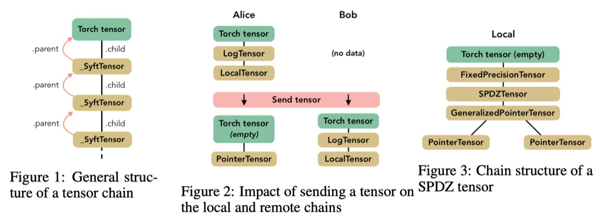

# 前言
1. 论文部分

> the chain of command; the chain of tensor

2. 总结：
    1. 用SyftTensor进行重载和重写floatTensor，通过用TorchHook机制来连接实现Tensor机制；
    2. 使用**work机制**来实现不同client间进行识别连接;发送  the chain of command 来控制对应的worker
    3. 使用通过Tensor的**send,get等操作**实现调用和控制计算方进行计算
    4. 流程: 1. 初始化SyftTensor 去重载floatTensor各种方法； 2. 初始化worker；相互添加识别worker；存储对象；通过 send_msg进行交流信息； excute_call由Tensor子类进行 3. Tensor中torchtensor通过 send() 调用worker传送对象
- Environment：使用 cs20; `source cs20/cs20/bin/activate`; 再执行 `jupyter notebook`
- Server端

```python
:Example Server:

    >>> from syft.core.frameworks.torch.hook import TorchHook
    >>> from syft.core.workers import WebSocketWorker
    >>> hook = TorchHook()
    Hooking into Torch...
    Overloading complete.
    >>> local_worker = WebSocketWorker(hook=hook,
                            id=2,
                            port=8181,
                            is_pointer=False,
                            is_client_worker=False)
    Starting a Websocket Worker....
    Ready to receive commands....
    Server Socket has been initialized
```

- Client端：

```python
:Example Client:

    >>> import torch
    >>> from syft.core.frameworks.torch.hook import TorchHook
    >>> from syft.core.workers import WebSocketWorker
    >>> hook = TorchHook(local_worker=WebSocketWorker(id=0, port=8182))
    Starting Socket Worker...
    Ready!
    Hooking into Torch...
    Overloading complete.
    >>> remote_client = WebSocketWorker(hook=hook,id=2, port=8181, is_pointer=True)
    >>> hook.local_worker.add_worker(remote_client)
    Attaching Pointer to Socket Worker...
    >>> x = torch.FloatTensor([1,2,3,4,5]).send(remote_client)
    >>> x2 = torch.FloatTensor([1,2,3,4,4]).send(remote_client)
    >>> y = x + x2 + x
    >>> y
    [torch.FloatTensor - Locations:[<syft.core.workers.SocketWorker object at 0x7f94eaaa6630>]]
    >>> y.get()
      3
      6
      9
     12
     14
    [torch.FloatTensor of size 5]
```

# worker机制
## 概述
worker类型分为Virtual Worker; Websocket Worker; socket Worker三类:

1. Virtual Worker 用于本地开发测试，
2. Websocket Worker用于本地浏览器中不同标签页开发测试，不涉及网络
3. Socket Worker真实环境的开发部署使用

以上所有类型的worker都继承BaseWorker；
worker和worker进行replicate the chain of commands and expose the very same interface 即运算方获取chain of commands再执行命令

### **Baseworker**
Baseworker类建立了**统一的interface**用于不同机器之间交流tensor,variables, models和其他网络相关的信息。这个决定了worker中**基础的用于存储对象的功能**并且**追踪已经知道的woker对象**。
这个类不包含任何特定的功能的信息例如p2p协议，路由协议，节点发现，socket结构。其他类来扩充类似的功能。
  
**追踪已经知道的woker对象**
 
- init方法中：实现辨识worker;加到本地的_known_workers的list

**统一的interface**

- 统一的接口交流：
    whoami方法;统一定义
- send_msg(),发送一系列string message给其他worker；由子类具体实现_send_msg(); 而_send_msg由子类worker具体实现

**基础的用于存储对象的功能**   

- set_obj（）注册；本地存储Tensor； key-value
- rm_obj（）
- get_obj（）

**交流信息**

- _execute_numpy_call 传播call到合适的TensorType中；辨认出一个Torch tensor命令（如client的call；接收从其他的worker）
- _execute_call 本地worker传播call到合适的TensorType 中；辨认出一个Torch tensor命令（如client的call；接收从其他的worker）；
    - raw_command key-value列表
    - ` result = child_type.handle_call(syft_command, owner=self)`child_type子类联系到Tensor类中来执行command命令‘；下面可知
- send_obj() `Sends an object to another :class: VirtualWorker and removes it from
        the local worker.`; 由send_msg()来具体执行,再由_send_msg()来执行


# SyftTensor

有SyftTensor父类；LocalTensor，_PointerTensor等来继承；

## _LocalTensor
存储数据，子类存储数据

- handle_call()：执行一个向前的命令在原始Tensor上；接收到一个syft命令和owner，转化为原始的Torch的命令。执行原始操作和再一次转化成syft Response 返回
    - 本地使用 
        ```
        native_func = torch._command_guard(attr, "torch_modules", get_native=True)
            command = native_func
        ```


## _TorchTensor

- send() `Give the root of the chain held by self to worker self->alice->obj
        [worker] => self->worker->alice->obj.`；1.获取worker对象； 2.执行本地worker中的send_obj()方法 -> send_msg() 3.
- get()

## _TorchVariable

- send()
- get()


