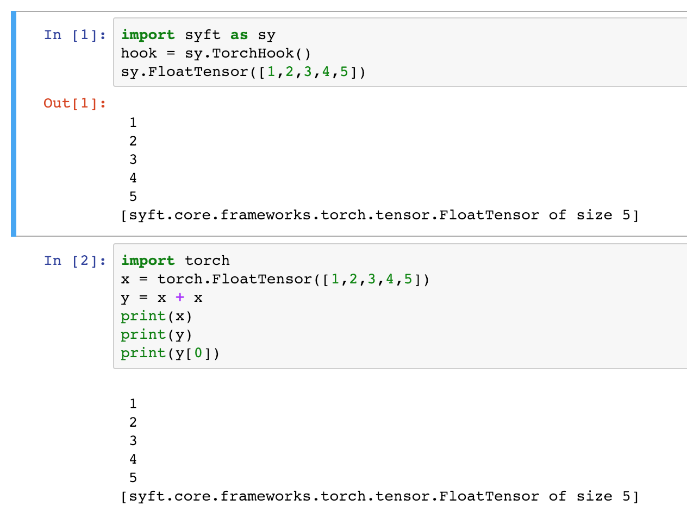

# 论文部分


**总结**：

> SyftTensors表示数据的状态或者转换(不存放真实数据)，相互之间可以链接在⼀一起
> Wrapper (FloatTensor) -> LocalTensor (our class) -> FloatTensor (actually holds the data)

**Note**：Wrapper就是包装器，被pytorch其余使用，一起工作，统一接口; operation and transaformation 就是 LocalTensor; FloatTensor就是真实存放数据的FloatTensor

关键点： 
1. Wrapper (FloatTensor) 与LocalTensor (our class)工作
2. LocalTensor(our class)与FloatTensor (actually holds the data)工作

改进:
LocalTensor.child -> Wrapper  提高了节省内存，提高效率


# Demo



# class TorchHook

```
define: class TorchHook() is designed for "A Hook which Overrides Methods on PyTorch Variables & Tensors"
即 完成重载 pytorch的 variables 和 Tensors.

The purpose of this class is to:

* extend torch methods to allow for the moving of tensors and variables from one worker to another
* override torch methods to execute commands on one worker that are called on tensors controlled by the local worker.
```

## __init__ 

1. 设置 TorchHook 挂载 local_worker;
2. 设置 torch.syft_tensor_name
3. 生成 self.to_auto_overload 列表

迭代循环torch Tensor 通过增加 Pysyft tensor功能

   
```python
for typ in torch.tensorvar_types:
    //挂载 pytorch tensor tensors and variable   
    self._hook_native_tensors_and_variables(typ)
    //挂载 pytorch张量用 Syft tensor types (LocalTensor,PointerTensor)
    self._hook_syft_tensor_types(typ)

//重载 pytorch module; move torch.module  to native_<function_name_here>
self._hook_torch_module() 

//重载 pytorch backward 其中的id属性
self._hook_backward()

//重载 torch.nn 
self._hook_module() 

// 执行命令
torch.eval_torch_modules()

sy.local_worker = self.local_worker
```

## `_hook_native_tensors_and_variable`

重载 给定native张量类型（pyTorch Tensor）的来添加PySyft Tensor功能
参数：tensor_type：A Torch tensor

```python
"""
用 Syft初始化方法 重新初始化TorchTensor的初始化方法
1. tensorvar_type.native___init__ = tensorvar_type.__init__
2. tensorvar_type.__init__ = new___init__, 生成owner，id等
"""
self._add_registration_to___init__(tensor_type, register_child_instead=True)
```

```python
"""
！！用Syft的属性重载PyTorch tensor的属性 =>Wrapper
生成LocalTensor Wrapper连接到LocalTensor；(Wrapper.child=LocalTensor)
~~LocalTensor连接到FloatTensor~~
挂载属性 child, id， 
"""
self._hook_properties(tensor_type)
```

```python
"""
 返回一系列被重载的方法，这些方法将会被保存在一个名为to_auto_overload的字典中，tensor_type将作为key。（剩下的不被自动重载）
"""
 self.to_auto_overload[tensor_type] = self._which_methods_should_we_auto_overload(tensor_type)
 def _which_methods_should_we_auto_overload(self, tensor_type=torch.FloatTensor)：
             if (
                (is_desc or (is_func and not is_service_func))
                and not is_base
                and not is_old
            ):
                to_overload.append(attr)
```

```python
"""
Renames functions that are that not auto overloaded as native functions
"""
self._rename_native_functions(tensor_type)
```

```python
"""Assigns methods to use as child for auto overloaded functions.(把函数当做子项给自动加载函数)
Parameters: tensor_type:Torch Tensor
// attr 返回的是方法列表
"""
self._assign_methods_to_use_child(tensor_type)：
    for attr in self.to_auto_overload[tensor_type]:
    
    def forward_method_to_child(self, *args, **kwargs):
    
    new_attr = self._get_overloaded_method(attr)
    //if we haven't already overloaded this method
    if attr not in dir(tensor_type) or getattr(tensor_type, attr) is None:
        setattr(tensor_type, attr, new_attr)
```

```python
"""Wrapper overloading partial objects of methods in the torch module.
包装器在torch模块中重载方法的部分对象。
编译命令，因此检查中的张量和变量args / kwargs，确定所有张量和变量的位置参与计算，并处理计算（在worker传递合适的TensorType处理，返回方法列表）
"""
def _get_overloaded_method(hook_self, attr):
    return worker._execute_call(attr, self, *args, **kwargs)； 返回Wrapper（self.method, self.child）
```


```python
"""
使用Torch方法重载自动重载;
Add methods to auto overloaded functions.
设置不在exclude列表中的方法[] 设置方法名为native_XXX 包括一些不在「torch.FloatTensor,
    torch.DoubleTensor,
    torch.HalfTensor,
    torch.ByteTensor,
    torch.CharTensor,
    torch.ShortTensor,
    torch.IntTensor,
    torch.LongTensor,」
"""
self._add_methods_from__TorchObject(tensor_type):
setattr(tensor_type, "native_" + str(attr), getattr(tensor_type, attr))
```

## `_hook_syft_tensor_types`
```python
 # 通过 Syft tensor types 重载 pytorch张量(LocalTensor,PointerTensor···)
self._hook_syft_tensor_types(typ):

// hook 挂载 LocalTensor
self._hook_LocalTensor(tensor_type)
self._hook_SyftTensor(tensor_type)
self._hook_PointerTensor(tensor_type)
self._hook_GeneralizedPointerTensor(tensor_type)
```

```python
//hook 挂载 LocalTensor
def _hook_LocalTensor(self, tensor_type):
    for attr in self.to_auto_overload[tensor_type]:
        new_attr = self._get_overloaded_method(attr)
        //if we haven't already overloaded this method
        if attr not in dir(_LocalTensor) or getattr(_LocalTensor, attr) is None:
            // 设置属性值
            setattr(_LocalTensor, attr, new_attr)

```

## `_hook_torch_module`
```python
def _hook_torch_module(self):
    """重载the main torch module的function
    实现这一目标的方法是首先移动torch中的所有现有模块功能
        module to native_ <function_name_here>。因此，真正的：func：`torch.cat`将成为
        ：func：`torch.native_cat`和：func：`torch.cat`将有我们的挂钩代码。
    """
```

## `_hook_backward`
```python
"""
用于计算所有梯度的向后重载方法。变量是产生自我的计算图的一部分。破坏了梯度后向传播 例如 id
"""
def _hook_backward(hook_self):
sy.Variable.native_native_backward = sy.Variable.native_backward

sy.Variable.native_backward = new_backward
def new_backward(self, *args, **kwargs):
"""
1. 保存相关的ids-保存所有当前父类梯度saved_grads；再reset var.grad
2. 执行向后传播 得到新的梯度值computed_grad
3. 先放回 saved_grads 为id， 再插入computed_grad的梯度值
"""
```

## `_hook_module`
```python
def _hook_module(self):
    """使用PySyft功能，主模块重载torch.nn.Module负责核心ML功能，如神经网络层和损失函数
    """
    // .send_obj()
    torch.nn.Module.send = module_send_
    
    // send_torch_command
    torch.nn.Module.get = module_get_
    
    torch.nn.Module.end_get = module_end_get_
    torch.nn.Module.move = module_move_
    torch.nn.Module.get = module_get_
    torch.nn.Module.fix_precision = module_fix_precision_
    torch.nn.Module.copy = module_copy_
```


