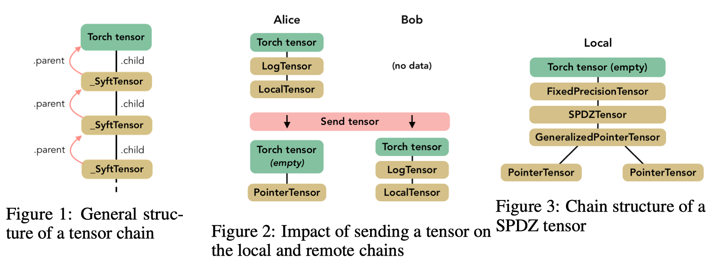

# 论文部分


> SyftTensors表示数据的状态或者转换(不存放真实数据)，相互之间可以链接在⼀一
> Wrapper (FloatTensor) -> LocalTensor (our class) -> FloatTensor (actually holds the data)

注意：Wrapper就是包装器，被pytorch其余使用，一起工作，统一接口; operation and transaformation 就是 LocalTensor; FloatTensor就是真实存放数据的FloatTensor

如何包装成 -> ? LocalTensor  LocalTensor如何连接到FloatTensor？ 增加属性？名字修改？ 

# TorchHook简介
define: class TorchHook() is designed for "A Hook which Overrides Methods on PyTorch Variables & Tensors"
即 完成重载 pytorch的 variables 和 Tensors.

结合论文中的图，
是LocalTensor的方法，执行Hook中的操作，可以将多个tensor连接。

## 解析Hook源代码
class目的：

- [扩展pytorch方法：允许移动tensor和variables 从一个worker到另一个worker] 如何去做？

`extend torch methods to allow for the moving of tensors and variables from one worker to another.` 

- [重写pytorch方法：在一个worker上执行命令，这个命令被称为tensor受localworker控制] 如何去做？

`override torch methods to execute commands on one worker that are called on tensors controlled by the local worker.`

当我们使用pysyft时，这个类一般我们是最先初始化。因为此类负责扩展pytorch上的pysyft的功能，例如远程执行

## 参数：

- local_worker(:class:`.workers.BaseWorker): 可以选择提供本地 local worker作为参数TorchHook将假定成为本地机器拥有的worker。如果将其留空，TorchClient将自动初始化VirtualWorker本地开发。
- is_client（bool，可选)无论TorchHook是否被初始化为end_user。这可能会影响是否当变量超出范围时，是否删除变量。如果你设置这在end_user上是错误的，Tensors和Variables会永远不会删除。如果在远程计算机上设置错误（不是客户），张量不会得到保存。这真的只是如果你没有自己初始化local worker，那很重要。（默认值：True）
- verbose（bool，可选）是否打印操作当他们发生。 （Defalt：True）
- queue_size (int, optional)max length of the list storing messages to be sent. (Default: 0)

## `__init__`

 1. 设置 TorchHook 挂载 local_worker;
 2. 设置 torch.syft_tensor_name

``` python
def __init__(self, local_worker=None, is_client=True, verbose=True, queue_size=0):
    # 1. 设置 local_worker
 	  self.local_worker = local_worker
    # 2. 设置名字
    torch.syft_tensor_name = [x.__name__ for x in sy._SyftTensor.__subclasses__()]
    torch_utils.define_enums()
    if not hasattr(torch, "torch_hooked"):           
        torch.torch_hooked = 0        
    else:            
        torch.torch_hooked += 1
    self.exclude = [
            "ndimension",
            "nelement",
            "size",
            "numel",
            "type",
            "tolist",
            "dim",
            "__iter__",
            "select",
            "__getattr__",
            "_get_type",
        ]
    # 加载列表
    self.to_auto_overload = {}
    if torch.torch_hooked > 0:         # 已经被挂载
        logging.warn("Torch was already hooked... skipping hooking process")
        self.local_worker = sy.local_worker    
    else: 
        if self.local_worker is None:
        """
        每一个TorchHook实例应有一个本地worker对象；这个worker对象负责与其他worker对象交流。
        worker界面允许TorchHook中的特定代码无需与worker与交流方式有关。(such as peer-to-peer, sockets, through local ports, or all within the same process)
        """
        self.local_worker = workers.VirtualWorker(
            hook=self,
            is_client_worker=is_client,
            queue_size=queue_size,
            id="me",
        )
        else:
            # if the local_worker already exists, then it MUST not know about the hook which is
            # just being created. Thus, we must inform it.挂载worker 与 hook  
            self.local_worker.hook = self
            
    # 对PyTorch Tensor 增加 pysyft方法 迭代 通过Torch tensor 添加PySyft张量函数
    # init中: torch.tensorvar_types = torch.tensor_types(torch.FloatTensor,...) + [torch.autograd.variable.Variable]
    for typ in torch.tensorvar_types:
        # 重载 给定的pytorch tensors and variable 添加方法  
        self._hook_native_tensors_and_variables(typ)
        # 重载 pytorch张量with Syft tensor types (LocalTensor,PointerTensor)
        self._hook_syft_tensor_types(typ)
    
    self._hook_torch_module() # 重载 pytorch module; move torch.module  to native_<function_name_here>
    self._hook_backward() # 重载 pytorch backward 其中的id属性
    self._hook_module() #  重载 torch.nn
    
    torch.eval_torch_modules()
    sy.local_worker = self.local_worker
```

## `_hook_native_tensors_and_variable`

``` python
def _hook_native_tensors_and_variables(self, tensor_type: torch.tensor):
    """
    Overloads given native tensor type (Torch Tensor) to add PySyft Tensor Functionality
    parameters: tensor_type: A Torch tensor
    重载 给定native张量类型（Torch Tensor）的来添加PySyft Tensor功能
    参数：tensor_type：A Torch tensor
    """
    # Reinitialize init method of Torch tensor with Syft init 用 Syft初始化方法 重新初始化TorchTensor的初始化方法 => 将syftTensor.native_init_设置成tensorVarType._init_；syftTensor_init_生成owner，id等
    self._add_registration_to___init__(tensor_type, register_child_instead=True)
    # Overaload Torch tensor properties with Syft properties  用Syft的属性重载PyTorch tensor的属性 = >Wrapper
    # 将属性设置到子类 hook中 Wrapper连接到LocalTensor；LocalTensor连接到FloatTensor
    self._hook_properties(tensor_type)
    # Returns a list of methods to be overloaded  which would be saved in a dictionary variable to_auto_overload with tensor_type being the key
# 返回一系列被重载的方法，这些方法将会被保存在一个名为to_auto_overload的字典中，tensor_type将作为key。
    self.to_auto_overload[tensor_type] = self._which_methods_should_we_auto_overload(tensor_type)
    # Rename native functions  重命名原始方法
    self._rename_native_functions(tensor_type)
    self._assign_methods_to_use_child(tensor_type)
    # Overload auto overloaded with Torch methods  ？？用Torch方法重载 被自动重载的方法
    self._add_methods_from__TorchObject(tensor_type)
```
### `_add_registration_to___init__`

``` python
# 重新初始化使用new__init__ 初始化添加 生成owner， id等 
def _add_registration_to___init__(hook_self, tensorvar_type, register_child_instead=False):
    '''
    Overloads tensor_type.__init__ or Variable.__init__ of Torch tensors to add PySyft tensor functionality
# TODO: This is added because of the following contradiction: instanciate x = FloatTensor()
        # and ask x.__module__, you'll get `sy.core.frameworks.torch.tensor.FloatTensor`
        # but now ask for dir(sy.core.frameworks.torch.tensor) you'll find no FloatTensor attribute
        # and x.float() will raise an exception because of this.
        # Why is x.__module__ == 'sy.core...'? How can we do this with elegance?

# 因为初始化实例 x = FloatTensor(),在sy.core.framework.torch no FloatTensor
    '''
    if tensorvar_type.__module__ != sy._SyftTensor.__module__:
        setattr(sy.core.frameworks.torch.tensor, tensorvar_type.__name__, tensorvar_type)
    if "native___init__" not in dir(tensorvar_type):
        tensorvar_type.native___init__ = tensorvar_type.__init__
        
    def new___init__(cls, *args, owner=None, id=None, skip_register=False, **kwargs):
 	# By Default assigns Local worker if user has not specified specific tensor type
        if owner is None:
            owner = hook_self.local_worker
        if register_child_instead:
            cls.native___init__()
cls._child = _LocalTensor(child=cls, parent=cls, torch_type=type(cls).__name__)
        else:
        kwargs["owner"] = owner
        kwargs["id"] = id
        kwargs["skip_register"] = skip_register
        cls.native___init__(*args, **kwargs)
        if id is None:
            id = int(10e10 * random.random())
        cls.id = id
        cls.owner = owner

        if not skip_register:
            owner.register_object(cls, id=id)
    # 使用new__init__ 初始化添加 生成owner， id等 
    tensorvar_type.__init__ = new___init__
```

### `_hook_properties`

``` python
def _hook_properties(hook_self, tensor_type):
'''
Overloads tensor_type properties；
Parameters: tensor_type: Torch tensor
# 既能检查参数，又可以用类似属性这样简单的方式来访问类的变量
# Python内置的@property装饰器就是负责把一个方法变成属性调用的;
# 把一个getter方法变成属性，只需要加上@property就可以了，此时，@property本身又创建了另一个装饰器@score.setter，
# 负责把一个setter方法变成属性赋值，于是，我们就拥有一个可控的属性操作;还可以定义只读属性，只定义getter方法，不定义setter方法就是一个只读属性
'''
@property
        def child(self):
            try:
                try:
                    assert self._child is not None
                    return self._child
                except (AttributeError, AssertionError):
                    // 设置wrapper的child为LocalTensor
                    self._child = _LocalTensor(
                        child=self, parent=self, torch_type=type(self).__name__
                    )
                    return self._child
            except TypeError:
                # for some reason, hasattr(self, '_child') returns a TypeError saying
                # "TypeError: 'NoneType' object is not callable". It's supposed to only
                # return False and I can't get to the bottom of it. So, for now, I'm
                # going to break a personal rule and use try/catch for logic, but
                # this is merely supposed to evaluate whether self has ._child as an
                # attribute. Note this only seems to happen when self is a
                # torch.autograd.Variable

                self._child = _LocalTensor(
                    child=self, parent=self, torch_type=type(self).__name__
                )
                return self._child

        @child.setter
        def child(self, value):
            self._child = value
     # 将属性设置到子类 hook中 Wrapper连接到LocalTensor；LocalTensor连接到FloatTensor
     tensor_type.child = child
     tensor_type.id = id
     tensor_type.location = location
     tensor_type.id_at_location = id_at_location
     tensor_type.owner = owner
```
### `_which_methods_should_we_auto_overload`

```python
def _which_methods_should_we_auto_overload(self, tensor_type=torch.FloatTensor):
'''
Creates list of Torch methods to auto overload except methods included in exclusion list
Parameters: Torch Tensor type (default: Float Tensor)
Return: List of methods to be overloaded
创建自动重载的PyTorch方法列表，但排除列表中包含的方法除外
 参数：Torch Tensor类型（默认值：Float Tensor）
 返回：List of methods to be overloaded
'''
to_overload = []
for attr in dir(tensor_type):
 # Conditions for inclusion/exclusion
    if attr in self.exclude:
        continue
    lit = getattr(tensor_type, attr)
    is_base = attr in dir(object)
    is_desc = inspect.ismethoddescriptor(lit)
    is_func = isinstance(lit, types.FunctionType)
    try:
        is_service_func = "HookService" in lit.__qualname__
    except Exception:
        is_service_func = False
    is_old = re.match("native*", attr) is not None
    if ((is_desc or (is_func and not is_service_func))and not is_base and not is_old ):
to_overload.append(attr)
    return to_overload
```

### `_rename_native_functions`

```python
def _rename_native_functions(self, tensor_type):
'''
Renames functions that are that not auto overloaded as native functions
Parameters: tensor_type: Torch tensor
重命名那些不能自动重载的native function
'''
    for attr in self.to_auto_overload[tensor_type]:
        lit = getattr(tensor_type, attr)
        # if we haven't already overloaded this function
        if f"native_{attr}" not in dir(tensor_type):
        setattr(tensor_type, f"native_{attr}", lit)
        setattr(tensor_type, attr, None)
```

### `_assign_methods_to_use_child`

```python
def _assign_methods_to_use_child(self, tensor_type):
    '''
    Assigns methods to use as child for auto overloaded functions.
Parameters: tensor_type:Torch Tensor
指定用作自动重载函数的子项的方法。
# Iterate through auto overloaded tensor methods
    '''
    for attr in self.to_auto_overload[tensor_type]:
    def forward_method_to_child(self, *args, **kwargs):
        # Method that accepts auto overloaded methods
        child_args = torch_utils.get_child_in_args(*args, **kwargs)
        response = getattr(self.child, attr)(*child_args, **kwargs)
        return response
    new_attr = self._get_overloaded_method(attr)
    # if we haven't already overloaded this method
    if attr not in dir(tensor_type) or getattr(tensor_type, attr) is None:
    setattr(tensor_type, attr, new_attr)
```

### `_add_methods_from__TorchObject`

``` python
def _add_methods_from__TorchObject(self, tensor_type: torch.tensor):
        """Add methods to auto overloaded functions.
           Parameters: tensor_type: Torch Tensor
           给 自动重载函数 添加方法
        """
        for attr in dir(parent_syft_obj):
            if attr not in exclude:
                if attr in dir(tensor_type) and "native_" + str(attr) not in dir(
                    tensor_type
                ):
                    setattr(
                        tensor_type, "native_" + str(attr), getattr(tensor_type, attr)
                    )
                setattr(tensor_type, attr, getattr(parent_syft_obj, attr))
```

##  `_hook_syft_tensor_types`

``` python
def _hook_syft_tensor_types(self, tensor_type):
    '''
    Overloads Torch Tensors with all Syft tensor types parameters: tensor_type: A Torch tensor 用 Syft tensor types 重载 Torch Tensors
    '''
    self._hook_LocalTensor(tensor_type)
    self._hook_SyftTensor(tensor_type)
    self._hook_PointerTensor(tensor_type)
    self._hook_GeneralizedPointerTensor(tensor_type)
```

### `_hook_LocalTensor`

```python
def _hook_LocalTensor(self, tensor_type):
Overloads LocalTensor

# iterate through all methods and tell them to call the native function on self.child
# 迭代所有方法并告诉他们在self.child上调用native function

for attr in self.to_auto_overload[tensor_type]:

            def forward_method_to_child(self, *args, **kwargs):

                child_args = torch_utils.get_child_in_args(*args, **kwargs)
                if attr == "zero_":
                    response = getattr(self.child, "native_" + attr)()
                else:
                    response = getattr(self.child, "native_" + attr)(
                        *child_args, **kwargs
                    )

                syft_node = type(self)(
                    child=response.child,
                    parent=None,
                    torch_type=type(response).__name__,
                )

                # Insert the new node just before the wrapper
                # syft_node.child = response.child
                response.child.parent = syft_node
                response.child = syft_node
                syft_node.parent = response

                return response

            new_attr = self._get_overloaded_method(attr)

            # if we haven't already overloaded this method
            if attr not in dir(_LocalTensor) or getattr(_LocalTensor, attr) is None:
                setattr(_LocalTensor, attr, new_attr)
```

### `_hook_SyftTensor`
```python
def _hook_SyftTensor(hook_self, tensor_type: torch.tensor):

        """Overloads SyftTensor
           Parameters: tensor_type:Torch Tensor
        """    
        hook_self._add_registration_to___init__(_SyftTensor)

        for attr in hook_self.to_auto_overload[tensor_type]:

            def forward_method_to_child(self, *args, **kwargs):

                child_args = torch_utils.get_child_in_args(*args, **kwargs)
                response = getattr(self.child, attr)(*child_args, **kwargs)

                syft_node = type(self)(child=response.child)

                # Insert the new node just before the wrapper
                # syft_node.child = response.child
                response.child.parent = syft_node
                response.child = syft_node
                syft_node.parent = response

                return response

            new_attr = hook_self._get_overloaded_method(attr)

            # if we haven't already overloaded this method
            if attr not in dir(_SyftTensor) or getattr(_SyftTensor, attr) is None:
                # call child method
                setattr(_SyftTensor, attr, new_attr)
```
### `_hook_PointerTensor`

```python

def _hook_PointerTensor(self, tensor_type: torch.tensor):

        """Overloads PointerTensor
           Parameters: tensor_type:Torch Tensor
        """

        for attr in self.to_auto_overload[tensor_type]:
            # # if we haven't already overloaded this method
            # if attr not in dir(_PointerTensor) or getattr(_PointerTensor, attr) is None:

            setattr(_PointerTensor, attr, self._get_overloaded_method(attr))
```


### `_hook_GeneralizedPointerTensor`
```python

def _hook_GeneralizedPointerTensor(self, tensor_type: torch.tensor):

        """Overloads PointerTensor
           Parameters: tensor_type:Torch Tensor
        """

        for attr in self.to_auto_overload[tensor_type]:
            # # if we haven't already overloaded this method
            # if attr not in dir(_GeneralizedPointerTensor) or
            # getattr(_GeneralizedPointerTensor, attr) is None:

            setattr(_GeneralizedPointerTensor, attr, self._get_overloaded_method(attr))
```

### `_get_overloaded_method`
    
```python
def _get_overloaded_method(hook_self, attr):
        """Wrapper overloading partial objects of methods in the torch module.
        Compiles command, checks for Tensors and Variables in the
        args/kwargs, determines locations of all Tensors and Variables
        involved in computation, and handles the computation
        accordingly.
        Wrapper在torch模块中重载方法的部分对象。
        编译命令，检查中的张量和变量
        args / kwargs，确定所有张量和变量的位置
        参与计算，并处理计算
        """

        def _execute_method_call(self, *args, **kwargs):
            worker = hook_self.local_worker
            try:
                return worker._execute_call(attr, self, *args, **kwargs)

            except NotImplementedError:

                result = _execute_method_call(self.child, *args, **kwargs)
                if not torch_utils.is_tensor(self):
                    result = type(self)(result)
                    if hasattr(result, "second_constructor"):
                        result = result.second_constructor()
                    return result
                else:
                    return result

        return _execute_method_call
```


## `_hook_torch_module`

```python
def _hook_torch_module(self):
        """Overloads functions in the main torch module.
        The way this is accomplished is by first moving all existing module functions in the torch
        module to native_<function_name_here>. Thus, the real :func:`torch.cat` will become
        :func:`torch.native_cat` and :func:`torch.cat` will have our hooking code.
        """

        for module_name, module_funcs in torch.torch_modules.items():
            torch_module = eval(module_name)
            for attr in module_funcs:
                # Some functions we want to ignore (not override). Such functions have been hard
                # coded into the attribute self.torch_exclude
                if attr in torch.torch_exclude:
                    continue

                # if we haven't already overloaded this function
                if f"native_{attr}" in dir(torch_module):
                    continue

                # if we haven't already overloaded this function (redundancy allowed)
                if "native_" in attr:
                    continue

                # Where the overloading happens
                lit = getattr(torch_module, attr)
                if type(lit) in [types.FunctionType, types.BuiltinFunctionType]:
                    new_attr = self._get_overloaded_function(module_name + "." + attr)
                    setattr(torch_module, f"native_{attr}", lit)
                    setattr(torch_module, attr, new_attr)
```

## ` _hook_backward(hook_self):`

```python
 def _hook_backward(hook_self):
        """Overloads backward method used to compute gradients of all the
        variables that are part of the computational graph which produced self.
        用于计算所有gradients的向后重载方法
        变量是产生自我的计算图的一部分。
        Because native backward breaks things (especially the .id
        attribute of the gradient), we store the id of all variables we
        can access (only the leaf variables of the graph) and we
        reconstruct our variables correctly after backward was performed
        by basically restoring the grad "envelope" (including its id)
        """
        sy.Variable.native_native_backward = sy.Variable.native_backward

        def new_backward(self, *args, **kwargs):
            worker = self.owner
            # Retrieve all the variable ids involved in the computation graph
            # 重新获得所有计算变量
            variable_ids = torch_utils.get_connected_variables(self)
            variable_ids = [
                var_id for var_id in variable_ids if var_id in worker._objects
            ]
            # Save all the gradients (to keep the id) and reset the grads
            # 保存所有梯度（id） 重置grads
            saved_grads = {}
            for variable_id in variable_ids:
                syft_tensor = worker.get_obj(variable_id)
                var = syft_tensor.parent
                assert var.id == variable_id
                saved_grads[variable_id] = var.grad
                var.grad = None

            # Performs the backward
            # 执行 native_native_backward
            self.native_native_backward(*args, **kwargs)

            # Put back the original grad envelop and insert the new grad value in it
            # 放入original grad；插入新的grad
            for variable_id in variable_ids:
                syft_tensor = worker.get_obj(variable_id)
                # retrieve the var to fix
                var = syft_tensor.parent
                # retrieve the old grad, and insert it  [first the envelope, then the data]
                saved_grad = saved_grads[variable_id]
                if saved_grad is not None:
                    # store the computed gradient
                    computed_grad = var.grad
                    var.assign_grad_(saved_grad)
                    # Insert the value of the computed_grad
                    if computed_grad is not None:
                        var.grad.data.native_set_(computed_grad.data)
                # Make sure everyone has the right owner
                torch_utils.enforce_owner(var, worker)

        sy.Variable.native_backward = new_backward
```

## `_hook_module(self):`

```python
def _hook_module(self):

        """Overloading torch.nn.Module with PySyft functionality, the primary module
           responsible for core ML functionality such as Neural network layers and
           loss functions
        """

        def module_is_missing_grad(model):
            """Checks if all the parameters in the model have been assigned a gradient"""
            missing_grad = False
            for p in model.parameters():
                if p.grad is None:
                    missing_grad = True
            return missing_grad

        def create_grad_objects(model):
            """Assigns gradient to model parameters if not assigned"""
            for p in model.parameters():
                o = p.sum()
                o.backward()
                p.grad -= p.grad

        def module_send_(self, dest):
            """Overloads torch.nn instances so that they could be sent to other workers"""
            if module_is_missing_grad(self):
                create_grad_objects(self)

            for p in self.parameters():
                p.send(dest)

            return self

        torch.nn.Module.send = module_send_

        def module_end_get_(self):
            """Overloads send to remote for torch.nn.Module."""
            if module_is_missing_grad(self):
                create_grad_objects(self)

            for p in self.parameters():
                p.end_get()

            return self

        torch.nn.Module.end_get = module_end_get_

        def module_move_(self, dest):
            return self.send(dest).end_get()

        torch.nn.Module.move = module_move_

        def module_get_(self):
            """overloads torch.nn instances with get method so that parameters could be sent back to owner"""
            for p in self.parameters():
                p.get()

            return self

        torch.nn.Module.get = module_get_

        def module_fix_precision_(self):
            """Overloads fix_precision for torch.nn.Module."""
            if module_is_missing_grad(self):
                create_grad_objects(self)

            for p in self.parameters():
                p.fix_precision_()

            return self

        torch.nn.Module.fix_precision = module_fix_precision_

        def module_copy_(self):
            return copy.deepcopy(self)

        torch.nn.Module.copy = module_copy_
```


